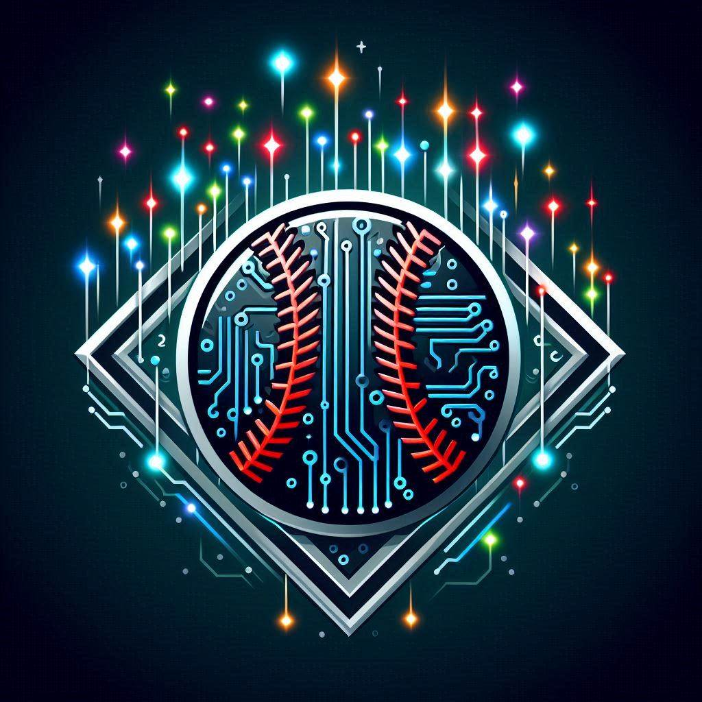

<!-- Improved compatibility of back to top link: See: https://github.com/othneildrew/Best-README-Template/pull/73 -->
<a id="readme-top"></a>
<!--
*** Thanks for checking out the Best-README-Template. If you have a suggestion
*** that would make this better, please fork the repo and create a pull request
*** or simply open an issue with the tag "enhancement".
*** Don't forget to give the project a star!
*** Thanks again! Now go create something AMAZING! :D
-->


<!-- PROJECT SHIELDS -->
<!--
*** I'm using markdown "reference style" links for readability.
*** Reference links are enclosed in brackets [ ] instead of parentheses ( ).
*** See the bottom of this document for the declaration of the reference variables
*** for contributors-url, forks-url, etc. This is an optional, concise syntax you may use.
*** https://www.markdownguide.org/basic-syntax/#reference-style-links
-->
[![Issues][issues-shield]][issues-url]
[![LinkedIn][linkedin-shield]][linkedin-url]


<!-- PROJECT LOGO -->
<br />
<div align="center">
  <a href="https://github.com/AndrewKelton/MLB_ALGO">
    
  </a>

<h3 align="center">MLB ALGO</h3>
  <p align="center">
    MLB_ALGO is a machine learning-based predictor for Major League Baseball (MLB) games. 
    <br />
    <a href="https://github.com/AndrewKelton/MLB_ALGO.git"><strong>Explore the docs »</strong></a>
    <br />
    <br />
    <a href="https://github.com/AndrewKelton/MLB_ALGO">View Demo</a>
    ·
    <a href="https://github.com/AndrewKelton/MLB_ALGO/issues/new?labels=bug&template=bug-report---.md">Report Bug</a>
    ·
    <a href="https://github.com/AndrewKelton/MLB_ALGO/issues/new?labels=enhancement&template=feature-request---.md">Request Feature</a>
  </p>
</div>


<!-- TABLE OF CONTENTS -->
<details>
  <summary>Table of Contents</summary>
  <ol>
    <li>
      <a href="#about-the-project">About The Project</a>
      <ul>
        <li><a href="#built-with">Built With</a></li>
      </ul>
    </li>
    <li>
      <a href="#getting-started">Getting Started</a>
      <ul>
        <li><a href="#prerequisites">Prerequisites</a></li>
        <li><a href="#installation">Installation</a></li>
      </ul>
    </li>
    <li><a href="#usage">Usage</a></li>
    <li><a href="#roadmap">Roadmap</a></li>
    <li><a href="#contact">Contact</a></li>
    <li><a href="#acknowledgments">Acknowledgments</a></li>
    <li><a href="#copyright-notice">Copyright Notice</a></li>
  </ol>
</details>


<!-- ABOUT THE PROJECT -->
## About The Project

<p>The project integrates multiple technologies to provide a comprehensive prediction system:</p>
    <ul align="left">
      <li>Machine Learning in C: The core predictive model is written in C, optimized for speed and accuracy.</li>
      <li>Flask API: The backend, built with Flask in Python, exposes API endpoints that serve game data and predictions to the frontend.</li>
      <li>ReactJS Frontend: A modern and dynamic ReactJS frontend interacts with the Flask API, allowing users to view game predictions in real-time.</li>
      <li>Twitter Integration with Tweepy: Automatically posts the top picks for the day to Twitter using Tweepy in Python.</li>
      <li>MLBStatsAPI: Team data is collected using the mlbstatsapi to provide up-to-date information for predictions.</li>
    </ul>

<p align="right">(<a href="#readme-top">back to top</a>)</p>


### Built With

* [![C][C-shield]][C-url]
* [![Python3][Python3-shield]][Python3-url]
* [![JavaScript][JavaScript-shield]][JavaScript-url]
* [![Flask][Flask-shield]][Flask-url]
* [![React][React.js]][React-url]
* [![Sqlite][SQLite-shield]][SQLite-url]


<p align="right">(<a href="#readme-top">back to top</a>)</p>


<!-- GETTING STARTED -->
## Getting Started

This is an example of how you may give instructions on setting up your project locally.
To get a local copy up and running follow these simple example steps.

### Prerequisites

This is an example of how to list things you need to use the software and how to install them.
* npm
  ```sh
  npm install npm@latest -g
  ```

### Installation

1. Clone the repo
   ```sh
   git clone https://github.com/AndrewKelton/MLB_ALGO.git
   ```
2. Install NPM packages
   ```sh
   npm install
   ```
3. If using a venv be sure to start it with
   ```sh
   source venv/bin/activate # on unix
   pip install -r requirements.txt
   ```
4. Change git remote url to avoid accidental pushes to base project
   ```sh
   git remote set-url origin AndrewKelton/MLB_ALGO
   git remote -v # confirm the changes
   ```

<p align="right">(<a href="#readme-top">back to top</a>)</p>


<!-- USAGE EXAMPLES -->
## Usage

Use this space to show useful examples of how a project can be used. Additional screenshots, code examples and demos work well in this space. You may also link to more resources.

_For more examples, please refer to the [Documentation](https://example.com)_

<p align="right">(<a href="#readme-top">back to top</a>)</p>


<!-- ROADMAP -->
## Roadmap

* Currently working on finishing up the 1st inning score prediction
* The website will be live before the 2025 MLB Season

See the [open issues](https://github.com/AndrewKelton/MLB_ALGO/issues) for a full list of proposed features (and known issues).

<p align="right">(<a href="#readme-top">back to top</a>)</p>


<!-- CONTACT -->
## Contact

* Twitter - [@ml_BETS](https://x.com/ml_BETS_)
* LinkedIn - [https://www.linkedin.com/in/andrew-kelton/](https://www.linkedin.com/in/andrew-kelton/)
* Project Link: [https://github.com/AndrewKelton/MLB_ALGO](https://github.com/AndrewKelton/MLB_ALGO)

<p align="right">(<a href="#readme-top">back to top</a>)</p>


<!-- ACKNOWLEDGMENTS -->
## Acknowledgments

* This project utilizes the [python-mlb-statsapi](https://github.com/zero-sum-seattle/python-mlb-statsapi) from the Zero Sum Seattle group.
* This project utilizes [tweepy](https://www.tweepy.org/).
  
<p align="right">(<a href="#readme-top">back to top</a>)</p>


<!-- COPYRIGHT NOTICE -->
## Copyright Notice

<p>This repository and its author are not affiliated with MLB or any MLB team. This API project interfaces with MLB's Stats API. Use of MLB data is subject to the notice posted at http://gdx.mlb.com/components/copyright.txt.</p>

<p align="right">(<a href="#readme-top">back to top</a>)</p>


<!-- MARKDOWN LINKS & IMAGES -->
<!-- https://www.markdownguide.org/basic-syntax/#reference-style-links -->
[contributors-shield]: https://img.shields.io/github/contributors/AndrewKelton/MLB_ALGO.svg?style=for-the-badge
[contributors-url]: https://github.com/AndrewKelton/MLB_ALGO/graphs/contributors
[forks-shield]: https://img.shields.io/github/forks/AndrewKelton/MLB_ALGO.svg?style=for-the-badge
[forks-url]: https://github.com/AndrewKelton/MLB_ALGO/network/members
[stars-shield]: https://img.shields.io/github/stars/AndrewKelton/MLB_ALGO.svg?style=for-the-badge
[stars-url]: https://github.com/AndrewKelton/MLB_ALGO/stargazers
[issues-shield]: https://img.shields.io/github/issues/AndrewKelton/MLB_ALGO.svg?style=for-the-badge
[issues-url]:https://github.com/AndrewKelton/MLB_ALGO/issues/4
[license-shield]: https://img.shields.io/github/license/AndrewKelton/MLB_ALGO.svg?style=for-the-badge
[license-url]: https://github.com/AndrewKelton/MLB_ALGO/blob/master/LICENSE.txt
[linkedin-shield]: https://img.shields.io/badge/-LinkedIn-black.svg?style=for-the-badge&logo=linkedin&colorB=555
[linkedin-url]: https://www.linkedin.com/in/andrew-kelton/
[product-screenshot]: img_src/afae2248-4c16-4fce-81b4-78a81b0f0d6c.jpeg 

[Python3-shield]: https://img.shields.io/badge/Python-3776AB?logo=python&logoColor=fff
[Python3-url]: https://www.python.org/
[React.js]: https://img.shields.io/badge/React-20232A?style=for-the-badge&logo=react&logoColor=61DAFB
[React-url]: https://reactjs.org/
[SQLite-shield]: https://img.shields.io/badge/SQLite-%2307405e.svg?logo=sqlite&logoColor=white
[SQLite-url]: https://www.sqlite.org/index.html
[C-shield]: https://img.shields.io/badge/C-00599C?logo=c&logoColor=white
[C-url]: https://www.open-std.org/jtc1/sc22/wg14/www/docs/n1570.pdf
[Flask-shield]: https://img.shields.io/badge/Flask-000?logo=flask&logoColor=fff
[Flask-url]: https://flask.palletsprojects.com/en/3.0.x/
[JavaScript-shield]: https://img.shields.io/badge/JavaScript-F7DF1E?logo=javascript&logoColor=000
[JavaScript-url]: https://developer.mozilla.org/en-US/docs/Web/JavaScript

[mlb-api-url]: https://github.com/zero-sum-seattle/python-mlb-statsapi


